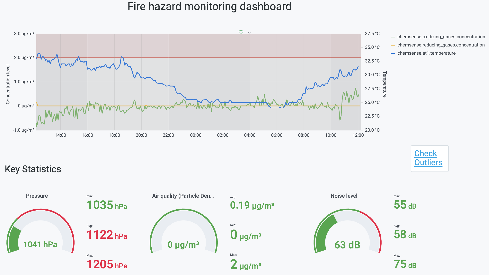

## CityNet: a city-scale environmental monitoring platform

## Table of Contents
1. [Introduction](README.md#introduction)
1. [Data pipeline](README.md#data-pipeline)
1. [Infrastructure](README.md#infrastructure)
1. [How to run the monitoring platform](README.md#how-to-run-the-monitoring-platform)
1. [Assumptions](README.md#assumptions)
1. [Contact Information](README.md#contact-information)


## Introduction
Fire hazard, poor air quality and excessive noise are some of the environmental challenges that have 
become synonimous with large cities. While these problems are well known to the public, there is still a lack of monitoring platforms, where various stakeholders can monitor the environmental conditions on a block-by-block resolution.

The [Array of Things](https://arrayofthings.github.io/) project aims to tackle this problem for Chicago city by providing real-time information on environmental and air quality conditions using more than 100 sensor nodes deployed at selected locations in the city.

This repo provides a data pipeline for streaming sensor data from the Array of Things API server. New sensor readings are fetched every 5 minute (interval set by the server) and stored in a Timescaledb database. 

Informative visualizations are made by querying the database. Because of its seamless integration with Timescaledb and its support for time series visualization, [Grafana](https://grafana.com/) is used to create the visualizations. Grafana also has a builtin support for setting a threshold and for sending notification alerts when the threshold is breached, which is a useful functionality with sensor readings.  

A [backend module](citynet/monitor.py) for real-time anomaly detection and key summary statistics is also provided in this repo.

Please click this image for a short demo of the visualization dashboard.
[](https://youtu.be/fZgwQc67qnk "Demo")

## Data pipeline 

Data is fetched by the [API client](citynet/api_client.py) and pushed into Kafka by a [Kafka Producer](citynet/producer.py)

On the other side of Kafka, each service registers as a [Kafka consumer](citynet/consumer.py) with a service-specific consumer group. This allows us to decouple the services from each other. 

<center></center>

## Infrastructure

The infrastructure setup largely depends on the available budget and non-functional requirements such as availability and fault-tolerance. The following figure shows the infrastructure setup on AWS. 

<center></center>

## How to run the monitoring platform

1. Spin up virtual machines as needed. But make sure at least Kafka and the database server have their own machine(s). See the [Infrastructure](README.md#infrastructure) section for the recommended setup.
2. Install and configure [Kafka](https://kafka.apache.org/)
3. Install and configure [PostgreSQL & Timescaledb](https://docs.timescale.com/latest/getting-started/installation)
4. Install and configure [Grafana](https://grafana.com/)
5. Make sure python 3.X is installed in all machines
6. Clone this repository

```bash
git clone https://github.com/mEyob/CityNet`
cd CityNet
```
7. Create a virtual environment (optional)

```bash
python -m venv <virtual-env-name>
```
8. Activate virtual environmet (optional)

```bash
source <virtual-env-name>\bin\activate
```
9. Install necessary packages 

```bash
pip install -r requirements.txt
```

10. Run Kafka producer and consumers. To check the available options:

```python
python producer.py --help
python consumer.py --help
```
11. Connect Grafana to the database and design a dashboard

## Contact information
[Misikir Eyob](https://meyob.github.io)
[LinkedIn](https://www.linkedin.com/in/misikir-eyob/)
mikireyob@gmail.com
